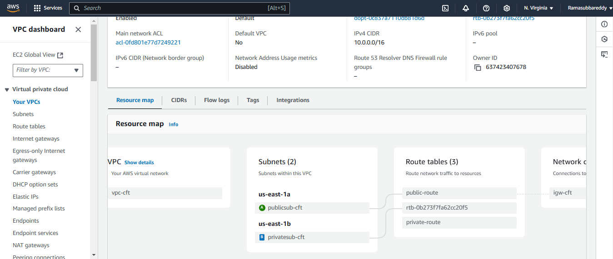

## Aws - CF - Task


## Create tje below listed resources, with AWS - Cloudformation !!

### - Create VPC using cloud formation
```
AWSTemplateFormatVersion: "2010-09-09"
Description: Create a VPC with public and private subnets.

Parameters:
  KeyPairName:
    Description: Name of an existing EC2 KeyPair to enable SSH access
    Type: String

Resources:
  MyVPC:
    Type: AWS::EC2::VPC
    Properties:
      CidrBlock: 10.0.0.0/16
      EnableDnsSupport: true
      EnableDnsHostnames: true
      Tags:
        - Key: Name
          Value: vpc-cft
```

#### - create Pub and Pvt subnets

```

  PublicSubnet:
    Type: AWS::EC2::Subnet
    Properties:
      VpcId: !Ref MyVPC
      CidrBlock: 10.0.0.0/24
      AvailabilityZone: "us-east-1a"
      MapPublicIpOnLaunch: true
      Tags:
        - Key: Name
          Value: publicsub-cft

  PrivateSubnet:
    Type: AWS::EC2::Subnet
    Properties:
      VpcId: !Ref MyVPC
      CidrBlock: 10.0.1.0/24
      AvailabilityZone: "us-east-1b"
      Tags:
        - Key: Name
          Value: privatesub-cft
```

#### - create Internet GateWay

```
  InternetGateway:
    Type: AWS::EC2::InternetGateway
    Properties:
      Tags:
        - Key: Name
          Value: igw-cft
```

#### - Attach IGW to VPC

```
  AttachGateway:
    Type: AWS::EC2::VPCGatewayAttachment
    Properties:
      VpcId: !Ref MyVPC
      InternetGatewayId: !Ref InternetGateway
```

#### - Create Pub and PVT RT

```
  PublicRouteTable:
    Type: AWS::EC2::RouteTable
    Properties:
      VpcId: !Ref MyVPC
      Tags:
        - Key: Name
          Value: public-route

  PrivateRouteTable:
    Type: AWS::EC2::RouteTable
    Properties:
      VpcId: !Ref MyVPC
      Tags:
        - Key: Name
          Value: private-route
```

#### - Attach IGW to Pub RT

```
  PublicRoute:
    Type: AWS::EC2::Route
    DependsOn: AttachGateway
    Properties:
      RouteTableId: !Ref PublicRouteTable
      DestinationCidrBlock: 0.0.0.0/0
      GatewayId: !Ref InternetGateway
```

#### - Attach Pvt Sub to Pvt rt

```
  PublicSubnetRouteTableAssociation:
    Type: AWS::EC2::SubnetRouteTableAssociation
    Properties:
      SubnetId: !Ref PublicSubnet
      RouteTableId: !Ref PublicRouteTable
```

#### - Create SecurityGroup for ssh // http

```
  MySecurityGroup:
    Type: AWS::EC2::SecurityGroup
    Properties:
      GroupDescription: Security group allowing SSH and HTTP access
      VpcId: !Ref MyVPC
      SecurityGroupIngress:
        - IpProtocol: tcp
          FromPort: 22
          ToPort: 22
          CidrIp: 0.0.0.0/0 # Open SSH to the internet (update for production security)
        - IpProtocol: tcp
          FromPort: 80
          ToPort: 80
          CidrIp: 0.0.0.0/0 # Open HTTP to the internet
      Tags:
        - Key: Name
          Value: MySecurityGroup
```

#### - Create a Ec2 in Pub Sub

```
  PublicEC2Instance:
    Type: AWS::EC2::Instance
    Properties:
      InstanceType: t2.micro
      SubnetId: !Ref PublicSubnet
      SecurityGroupIds:
        - !Ref MySecurityGroup
      KeyName: MyKeyPair
      ImageId: ami-0866a3c8686eaeeba # Replace with your desired AMI ID
      Tags:
        - Key: Name
          Value: MyEC2Instance-public
```

- Create a Ec2 in Pvt Sub 

```
  PrivateEC2Instance:
    Type: AWS::EC2::Instance
    Properties:
      InstanceType: t2.micro
      SubnetId: !Ref PrivateSubnet
      SecurityGroupIds:
        - !Ref MySecurityGroup
      KeyName: MyKeyPair
      ImageId: ami-0866a3c8686eaeeba # Replace with your desired AMI ID
      Tags:
        - Key: Name
          Value: MyEC2Instance-private


 
  EC2KeyPair:
    Type: AWS::EC2::KeyPair
    Properties:
      KeyName: MyKeyPair
      Tags:
        - Key: Name
          Value: MyKeyPair

```
