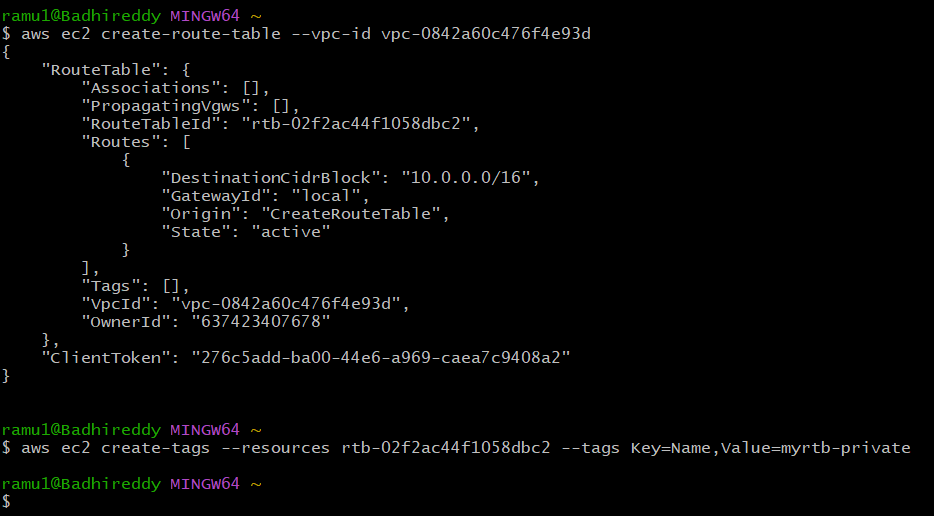

# --Create VPC using cli
```
aws ec2 create-vpc --cidr-block 10.0.0.0/16
```

```
aws ec2 create-tags --resources vpc-0842a60c476f4e93d --tags Key=Name,Value=ramu-vpc
```


# --create Pub and Pvt subnets
```
aws ec2 create-subnet --vpc-id vpc-0842a60c476f4e93d --cidr-block 10.0.1.0/24 --availability-zone us-east-1a
```

```
aws ec2 create-tags --resources subnet-069647ddd6999f47c --tags Key=Name,Value=ramu-cli-public
```


```
aws ec2 create-subnet --vpc-id vpc-0842a60c476f4e93d --cidr-block 10.0.2.0/24 --availability-zone us-east-1a
```
```
aws ec2 create-tags --resources subnet-0d56cb13399d24ff3 --tags Key=Name,Value=ramu-cli-public
```


# --create IGW and --Attach IGW to VPC
```
aws ec2 create-internet-gateway
```


```
aws ec2 attach-internet-gateway --vpc-id vpc-0842a60c476f4e93d --internet-gateway-id igw-0588ac8bc510dc097

```


# - Create Public and Private Routetables


```
aws ec2 create-route-table --vpc-id vpc-0842a60c476f4e93d
```

```
aws ec2 create-tags --resources rtb-0b2b96d6708e9a379 --tags Key=Name,Value=myrtb-public
```


```
aws ec2 create-route-table --vpc-id vpc-0842a60c476f4e93d
```

```
aws ec2 create-tags --resources rtb-02f2ac44f1058dbc2 --tags Key=Name,Value=myrtb-private
```



# - Attach Public subnet to Public rtb

```
aws ec2 associate-route-table --subnet-id subnet-069647ddd6999f47c --route-table-id rtb-0b2b96d6708e9a379
```

```
aws ec2 associate-route-table --subnet-id subnet-0d56cb13399d24ff3 --route-table-id rtb-02f2ac44f1058dbc2
```


```
aws ec2 create-route --route-table-id rtb-0b2b96d6708e9a379 --destination-cidr-block 0.0.0.0/0 --gateway-id igw-0588ac8bc510dc097
```


```
aws ec2 create-security-group --group-name MySecurityGroup --description "Security group for SSH and HTTP access" --vpc-id vpc-0842a60c476f4e93d

```


```
aws ec2 authorize-security-group-ingress --group-id sg-09b9b8ca2a1a24678 --protocol tcp --port 22 --cidr 0.0.0.0/0
```

```
aws ec2 authorize-security-group-ingress --group-id sg-09b9b8ca2a1a24678 --protocol tcp --port 80 --cidr 0.0.0.0/0
```


```
aws ec2 run-instances --image-id ami-0166fe664262f664c --count 1 --instance-type t2.micro --key-name devops --security-group-id subnet-069647ddd6999f47c
```


```
aws ec2 run-instances --image-id ami-0166fe664262f664c --count 1 --instance-type t2.micro --key-name devops --security-group-id subnet-0d56cb13399d24ff3
```


